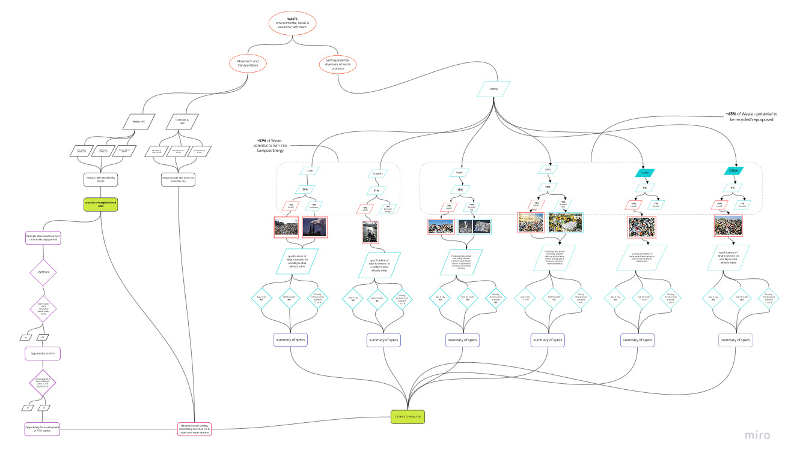
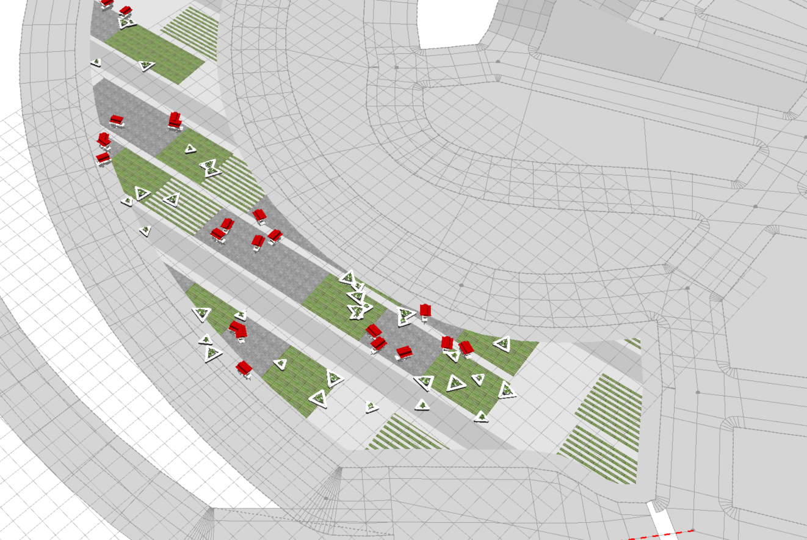
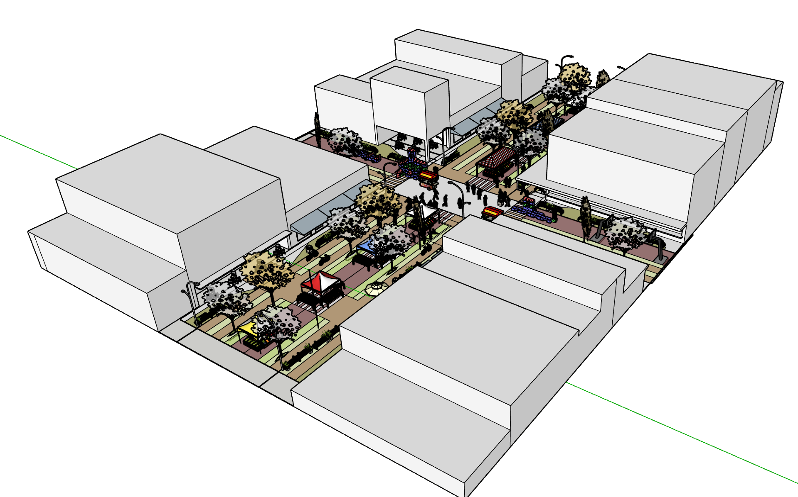
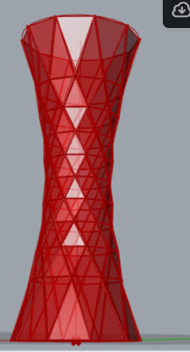
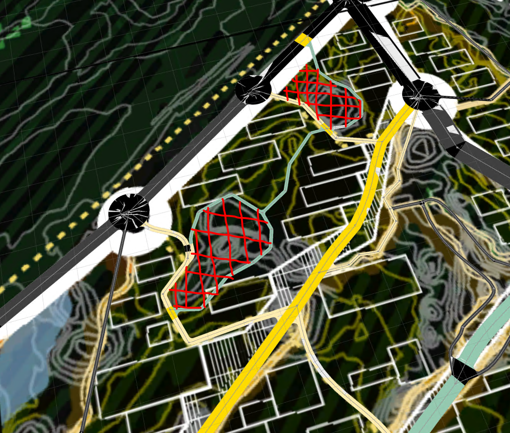
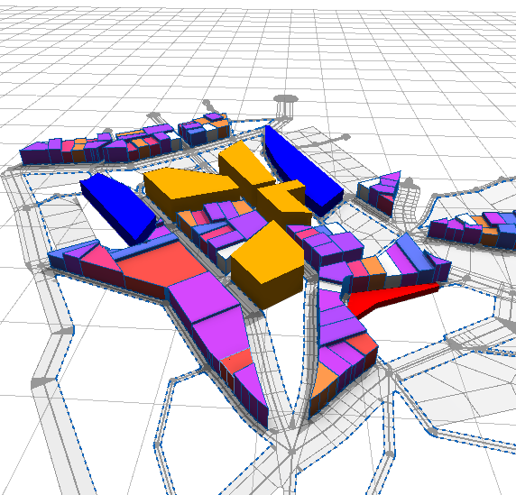
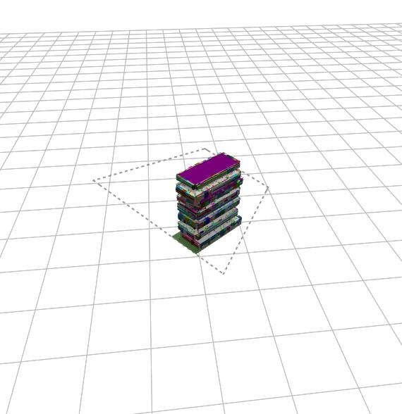

# UrbanLab
CUNY Spitzer School of Architecture - 2021

Repository to place all CityEngine code for Unit26 for the Spitzer School of Architecture. A syllabus for the class that created this repository *[click here](https://docs.google.com/document/d/1OeA53enEJdavxhBFRCKM4Jie3uw_BkkP8MtLnRKEhug/edit?usp=sharing)*

## Intro
This repository is a collaboration of different teams assembled in **Unit26’s Design Anarchy Studio**. The repository contains the code for each individual system created by the groups of students of 2021. These systems are the result of viewing the city as a series of self-assembled systems that interact and integrate with one another. The following systems were identified:

1. Waste and Density
2. Events and Community(Balance Spaces)
3. Telecommunications
4. Surfacescapes (“Streets”)
5. Economic Activity (“Commercial”)
6. Urban Ecology

To view a high level preview of the systems in a web scene *[click here](https://arcg.is/1OeKDP0)*

## About the repository’s use

The repository is meant to be use in coordination with *[CityEngine 2021.1](https://doc.arcgis.com/en/cityengine/latest/whats-new/cityengine-whats-new.htm)*. 

For optimal use, you should copy the repositoy to the *Default Workspace* that CityEngine generates on your desktop. These rules can be used with any dataset, but some of them work specifically with attributes generated in a GIS environment.

You can download the sample data the class used to develop the system rules [as a geodatabase here](https://ccny.maps.arcgis.com/home/item.html?id=4c42640d19f44663b3bbdefa599d31e5#overview) and a [hosted service here](https://services3.arcgis.com/sJvdLIgPMD7cWjlL/arcgis/rest/services/TheSite/FeatureServer).

## About the systems

Here you can find a high level description of the systems that make up the Urban Lab. They have been designed as autonomous systems with different degrees of decentralization. The systems stand alone by themselves and are not meant to fully integrate into one another. Nevertheless, an attempt has been made to coordinate the different systems to show their combined potential.

### Waste and Density

### Events and Community(Balance Spaces)

### Telecommunications

### Surfacescapes (“Streets”)

### Economic Activity (“Commercial”)

### Urban Ecology

## Feedback

Any feedback can be sent to the repository owners: htarridopicart@ccny.cuny.edu, srickenbacker@ccny.cuny.edu

—

Contributors: Anabella Acevedo Peña, Sussan Mejia Prior, Brandon Neva, Katherine Kenny, Meg Kalinowski , Steven Kaminski, Nathan Laveau,Rebecca Hager, Sidnie Ancion, Caner Sahin, Xianonen Tang,

Professors: Prof. Héctor Tarrido-Picart, Prof. Julio Salcedo, Prof. Shawn Rickenbacker