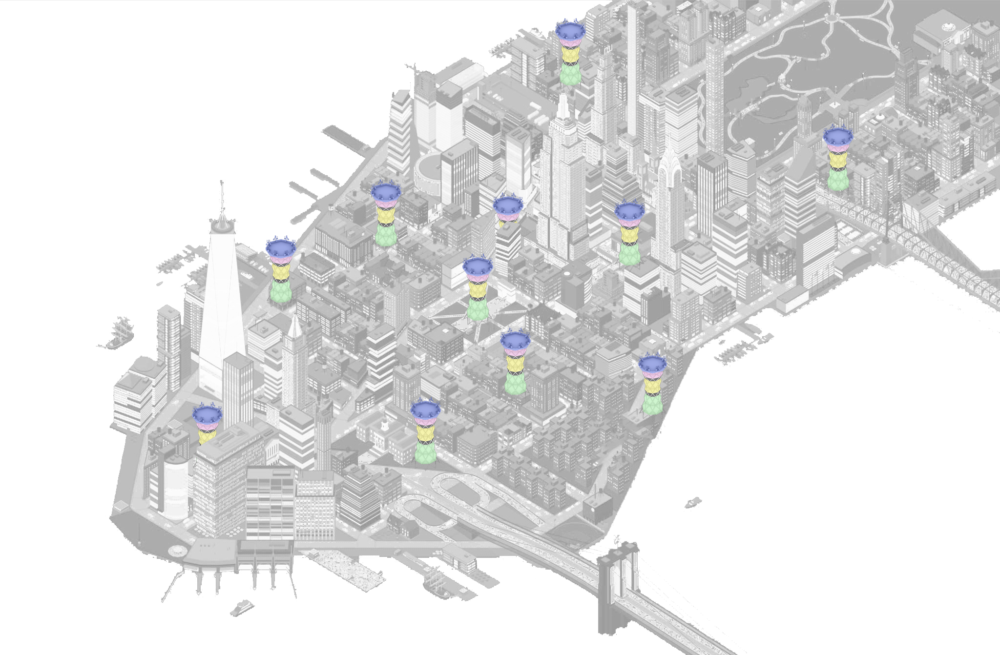

# UrbanLab
CUNY Spitzer School of Architecture - 2021

Repository to place all CityEngine code for Unit26 for the Spitzer School of Architecture. A syllabus for the class that created this repository *[click here](https://docs.google.com/document/d/1OeA53enEJdavxhBFRCKM4Jie3uw_BkkP8MtLnRKEhug/edit?usp=sharing)*

## Intro
This repository is a collaboration of different teams assembled in **Unit26’s Design Anarchy Studio**. The repository contains the code for each individual system created by the groups of students of 2021. These systems are the result of viewing the city as a series of self-assembled systems that interact and integrate with one another. The following systems were identified:

1. Waste and Density
2. Events and Community(Balance Spaces)
3. Telecommunications
4. Surfacescapes (“Streets”)
5. Economic Activity (“Commercial”)
6. Urban Ecology

To view a high level preview of the systems in a web scene *[click here](https://arcg.is/1OeKDP0)*

## About the repository’s use

The repository is meant to be use in coordination with *[CityEngine 2021.1](https://doc.arcgis.com/en/cityengine/latest/whats-new/cityengine-whats-new.htm)*. 

For optimal use, you should copy the repositoy to the *Default Workspace* that CityEngine generates on your desktop. These rules can be used with any dataset, but some of them work specifically with attributes generated in a GIS environment.

You can download the sample data the class used to develop the system rules [as a geodatabase here](https://ccny.maps.arcgis.com/home/item.html?id=4c42640d19f44663b3bbdefa599d31e5#overview) and a [hosted service here](https://services3.arcgis.com/sJvdLIgPMD7cWjlL/arcgis/rest/services/TheSite/FeatureServer).

## About the systems

Here you can find a high level description of the systems that make up the Urban Lab. They have been designed as autonomous systems with different degrees of decentralization. The systems stand alone by themselves and are not meant to fully integrate into one another. Nevertheless, an attempt has been made to coordinate the different systems to show their combined potential.

A high level, visual presentation of the systems can be viewed in [this Miro Board](https://miro.com/app/board/o9J_lr7Fuys=/)

### Waste and Density

> A decentralize waste management within the first mile that by inserting new waste typologies increases civic engagement to properly sort waste; maximizing its value in secondary markets and reducing the its distance travels.

### Events and Community (Balance Spaces)

> Balance Spaces, as part of the system of the city, are homeostatic places that restore and provide equilibrium to the city. They regulate the dynamic entourage and foster citizen exchange and equity through city events and community activities.

### Telecommunications

> A decentralize power and data network that is more resilient and can serve the entire community.

### Surfacescapes (“Streets”)

> A surface network that focuses on human powered mobility, community activation and productive systems. Its architecture symbiotically links to existing site infrastructure and topographies; maximizing environmental gains while promoting new activations within the public realm.

### Economic Activity (“Commercial”)

> A system that creates "Fluid Economies" through diverse commercial types. The system distributes communal income equally in a sustainable way.

### Urban Ecology

> A system that reimagines impervious city surfaces to be performative through augmented ecology for efficient rain/storm-water management, heat mitigation, reduced energy consumption, ecosystem biodiversity and improved human health.

## Feedback

Any feedback can be sent to the repository owners: htarridopicart@ccny.cuny.edu, srickenbacker@ccny.cuny.edu

—

Contributors: Anabella Acevedo Peña, Sussan Mejia Prior, Brandon Neva, Katherine Kenny, Meg Kalinowski , Steven Kaminski, Nathan Laveau,Rebecca Hager, Sidnie Ancion, Caner Sahin, Xianonen Tang,

Professors: Prof. Héctor Tarrido-Picart, Prof. Julio Salcedo, Prof. Shawn Rickenbacker
